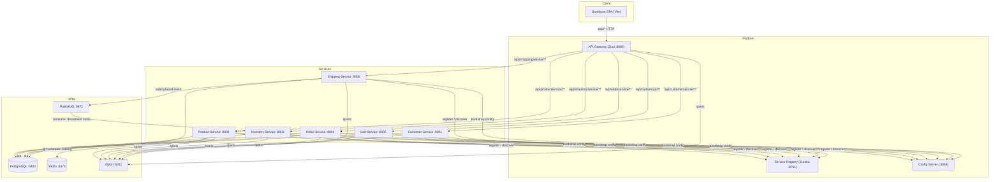
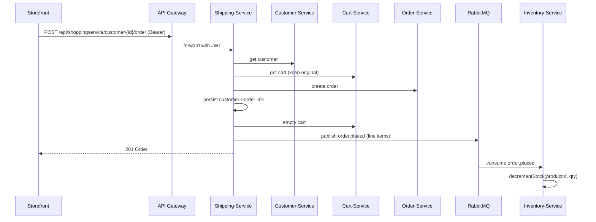
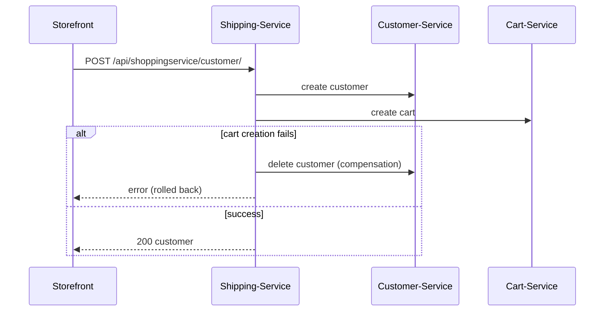
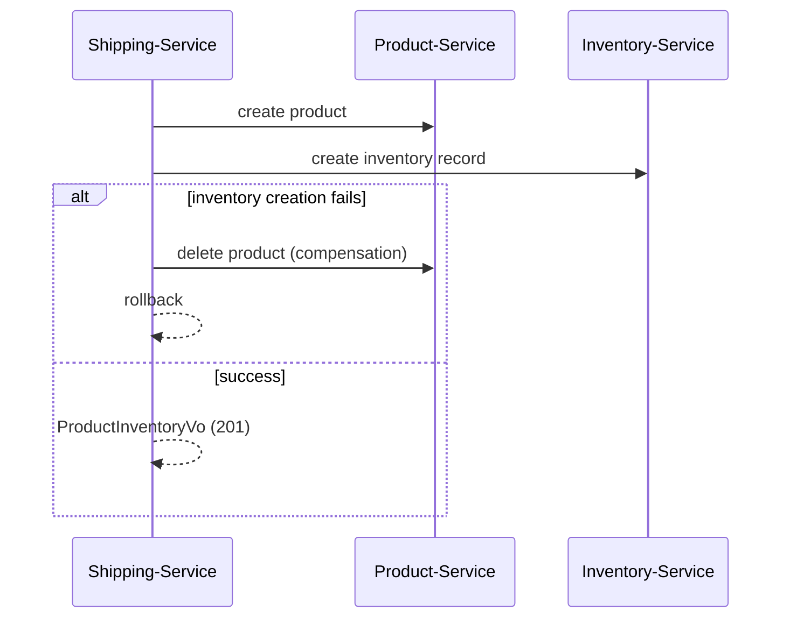

# Architecture Diagram (Mermaid)

> Render this file in any Mermaid-capable viewer (GitHub, Mermaid Live Editor, VS Code).

## System context

## Place-order flow (saga)

## Create customer (composite, with compensation)

## Create product (composite, with compensation)

